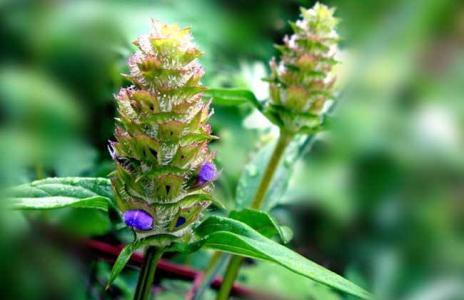
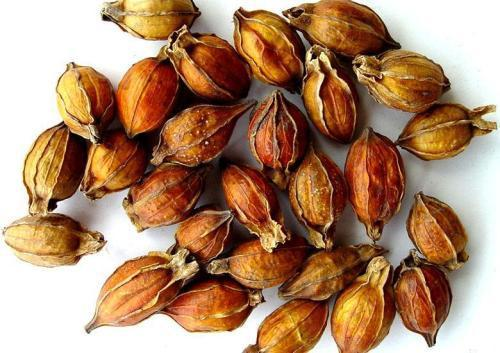
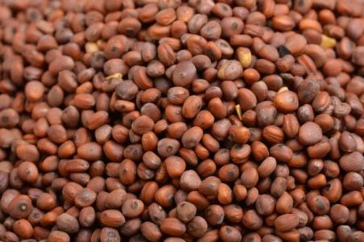
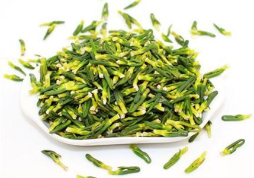
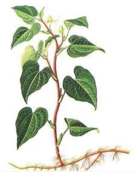

人体有五脏六腑，最常见的就是以下五种热了。内热太大的话，人会烦躁不安、口舌生疮、口臭等等，很不舒服。大家可以把上面的方法收藏起来，关键时刻有用啊，大人小孩都可以用哦！

一、肝经有热用夏枯草

肝经有热的时候会出现眼睛干、爱发脾气、脸上长痘，部分女性还会出现乳房胀痛，小孩子会出现眼屎多、眼睛红、烦躁等症状。这时候很简单，用夏枯草泡水就可以了。夏枯草入肝、胆经，清肝火效果非常好。《滇南本草》中说它“祛肝风，行经络，治口眼歪斜。行肝气，开肝郁……”。给宝妈们说件悲伤的事，夏枯草到了夏天真的会枯萎，所以才叫夏枯草，听起来好伤心啊！不过效果还是蛮好的！

二、胃经有热用栀子

胃经有热这时候无论大人还是小孩子，就会出现口臭、牙龈肿痛、烦躁、口渴想喝水、口腔溃疡、舌尖烂等症状。这时候用桅子的花骨朵泡水喝效果挺好的，桅子入心、肝、肺、胃经，能够清胃火。《别录》中说，桅子“疗目热亦痛，胸心、大小肠大热，心中烦闷，胃中热气。”拿上两三颗，泡水喝就可以了。

三、大肠经有热用莱菔子

大肠经有热的时候，会出现大便干结、大便臭、肛门痒、肚子胀、肚子痛、面色粗糙、易长痘等等。这时候可以到药店买点莱菔子，回来抓上小半把熬水喝。莱菔子就是白萝卜的种子，能够消食除胀，降气化痰。各位宝妈，如果孩子出现大便干结、有食积，用莱菔子效果最好了。

四、心经有热用莲子心

心火旺盛会表现为心烦、口干、盗汗、口腔溃疡、尿黄等症状，这时候用莲子心泡水喝效果最好了。它本身不仅可以清心去火，还可以安神益智，平和五脏之气。

五、肺经有热用鱼腥草

有肺火的时候会出现嗓子干疼、干咳、流鼻血等症状，这时候可以用鱼腥草。鱼腥草入肺经，有清热解毒的作用，一般出现肺炎、急慢性支气管炎等疾病的时候常常会用到它。用法也很简单，鱼腥草熬成水代茶饮就可以了。

