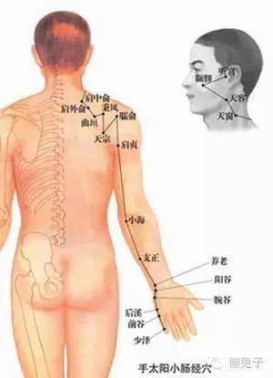
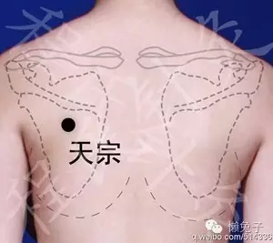
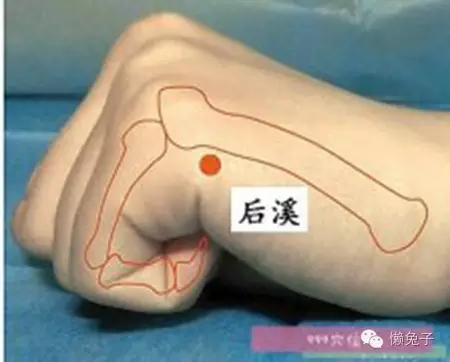

颈椎病症状：__颈背疼痛、上肢无力、手指发麻、下肢乏力、头晕、恶心、呕吐，视物模糊、甚至心动过速。__

颈椎之所以出现疼痛、僵直、麻木等，都是因为经络不通，气血走不过去。而颈椎又关联到头部，所以当气血受阻，无法畅通时，就会导致`头部气血供应不足`，而出现眩晕、眼花等症状。

主管颈椎的经络不在肩颈上，在我们的两个胳膊上。 而且是在胳膊的外侧。

胳膊外侧有三条阳经，分别是`手阳明大肠经`、`手太阳小肠经`和`手少阳三焦经`。

经络是左右对称的。经过我们颈椎部分的，就是手太阳小肠经。也就是说，当我们颈椎出现问题时，其实是`小肠经`的经络不通。颈椎病的真正病根儿，在小肠经！

【治疗方法】:应该是`沿着`小肠经的`行走路线`进行推拿。先简单捏揉一下肩颈部位的肌肉，放松一下，然后从肩中俞穴开始，每个穴位点按1分钟后，揉搓行至下一个穴位。这里要特别提醒注意的就是`天宗穴`。《针灸甲乙经》：“肩重，肘臂痛不可举，天宗主之”，它的主要作用就是生发阳气。

__如果天宗穴找准，不管被按压人有没有严重的颈椎病，都会有明显的胀痛感，并伴有麻酥感__。经络通的人，这种麻胀感可以一直通到手指，如果经络不通，麻胀感就会只停留在大臂。__这个穴位至少要按压2-3分钟，再痛也要忍着。__

接着往下走，按摩大臂上的肩贞穴，除了在这个穴位上按压以外，__最重要的是要沿着小肠经的路线，揉开大臂上的硬块__。一个颈椎病患者，他的大臂外侧绝对不会是柔软的，一定会有很多结块，揉搓起来非常疼痛，这个其实就是经络不通的表现。

越是疼，越是要揉。但是揉的时候不要揪着皮搓，而是感觉力道往下走，慢揉，让力道渗入到肌肉中去。否则第二天就会出现青紫色的瘀斑.

大臂按揉至少要保证20分钟，顺着经络图的穴位往小臂走。小臂肉少，揉起来没手感，所以就以按揉穴位为主，最后就到手了。

高潮在这里！！！

这个穴位就是治疗颈椎病`最最重要`的一个穴位了，叫`后溪穴`。后溪最早见于《黄帝内经·灵枢》，为手太阳小肠经的`俞穴`，又为`八脉交会之一`，通于督脉属小肠经。有舒经利窍、宁神之功。

这个穴位长的很深，一般用指尖很难刺激到。必须要借助点别的工具，比如梳子的背面，或者桌子的边缘，用按压或者滚动按压的方法都很好。

__刺激这个穴位，对于治疗颈椎病有事半功倍之效，因为它主治头项强痛、腰背痛、手指及肘臂挛痛等痛证。__ 是收工动作。

天宗穴是打通从肩膀到手指方向的，`后溪穴`是从`手指`向`肩膀`方向打通。所以这个穴位至少要按压`3-5分钟`，不管怎么酸痛，都要坚持，因为只有这样，才算是把整条小肠经打通了。

`小肠`和`心`相表里，所以小肠经不通，也会引发心脏问题，这就是为什么颈椎不好的人，会有心动过速或者心口痛等问题的原因。

__治疗时记得两个胳膊都要按！__

